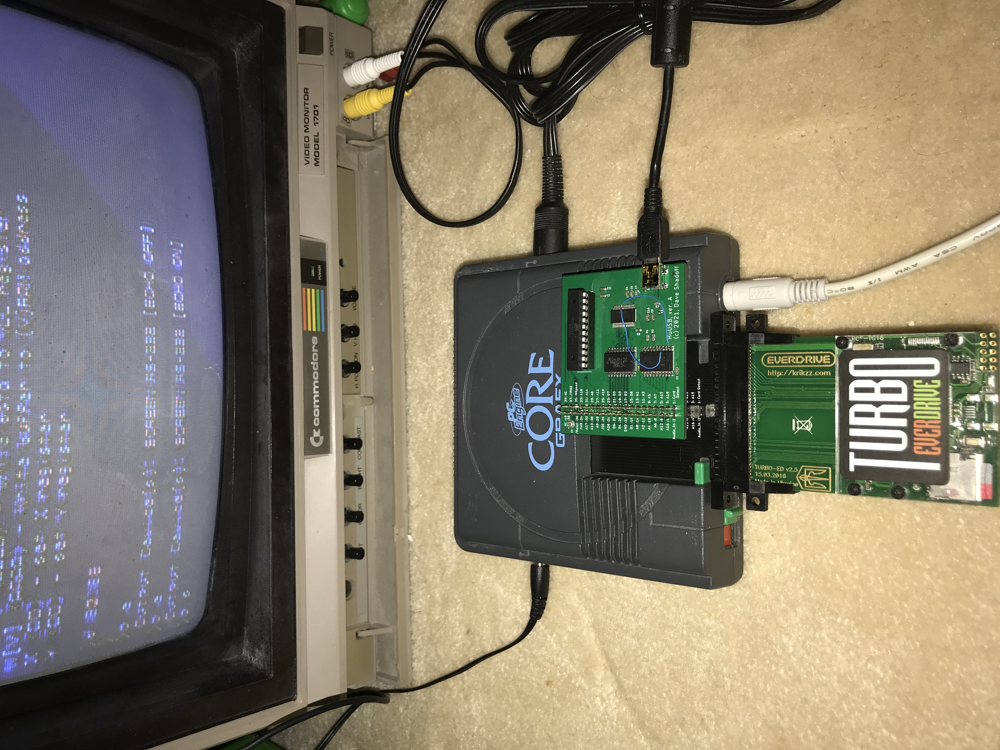
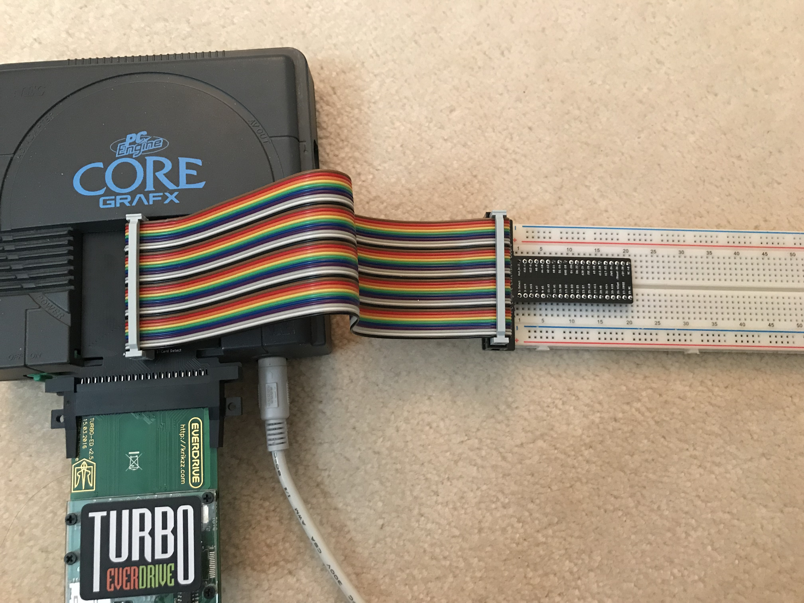

# PC Engine HuBus Project

Rather than create separate repositories for each of the projects, this repository will
hold all of my projects related to the HuBus (based off of the HuCard port on the PC Engine).

## HuCard_Breakout

This is a board - actually 2 boards - which are a total of 2.4mm thick, and plug into
the HuCard slot.  A HuCard connector (rare, unfortunately) is attached at the end, but
a 40-pin (2x20) Raspberry Pi GPIO-type header header is mounted in the middle, exposing
all signals.  This becomes the basis of the bus; various memory-based peripherals.

### How to build:
You will need both HuCard_Breakout and HuCard_Breakout_under boards - the gerber files
are included:
- Make the HuCard_Breakout board 1.6mm thick, I use ENIG finish - not as durable as hard gold, but much cheaper
- Make the HuCard_Breakout_under board 0.8mm thick
You will probably want a stencil, since the two boards areintended to be held together
with solder:  I apply a low-temperature solder paste along the metallized edge, and bake
with a regular lead solder profile, with the board held together by miniature letter clips.

There are often tiny spheres of solder at the edges, which can be removed easily with a
light scrape along the edge.

Once the board is properly attached, don't forget to sand a bevel on the leading edge of
the card-edge: I use sandpaper of about 180 grit, and sand gently by hand until a bevel of
slightly less than 1mm exists evenly.

For attaching the header (and card edge connector), I clip the leads as close as possible to
the board **before soldering**, so that no sharp edges remain after the soldering.
Ideally, the solder is level, but a gentle convex curve is acceptable.

## HuMem board

This board attaches to the bus, and presents the following to the bus:
- Flash memory (SST39SF010A, PDIP) at banks $90 through $9F
- Static RAM (LY625128SL-55LLI available as part of JLCPCB's SMD assembly service) at banks $B0-$EF

I have included the gerbers and relevant bom.csv and assembly.csv files to get these boards
assembled by JLCPCB, but you will still need the following parts:
- ATF16V8BQL, PDIP (and socket), and an EPROM programmer capable of programming these
- SST39SF010A, PDIP (and scoket), and as EPROM programmer capable of programming these
- a longer-than-usual 2x20 DIP header, such as PRT-16763 from Sparkfun

### How to build
Assembly should be straightforward - just remember that the long pins server as next-level
pin headers for the bus, and that the IC chips don't all face in the same direction.

### GAL logic
The GAL (ATF16V8BQL) serves as the address decoder on this board, and can be reprogrammed to
locate these memories anywhere in the address space.

The logic for this was assembled using an obsolete software package, WinCUPL, because there are
very few ways to program for 5V logic anymore (and I didn't want to use level-shift for everything
on this board).  The key files to reference in that folder are:
- MEMSEL.PLD - the CUPL source code; should be more or less self-explanatory
- MEMSEL.si  - simulation test inputs/outputs for validation of the design
- MEMSEL.jed - used for programming the GAL device

## HuUSB board

This board attaches to the bus, and presents an FTDI FT245RL to the bus:
- at $FF:$1C00 : data input/output
- at $FF:$1C01 : status
  - bits 7-4 (most-significant nybble):  value $Ax for identification
  - bits 3-2 : value 0, 0
  - bit  1 : TX ready : when low, it is ready for data to be sent to USB
  - bit  0 : RX ready : when low, there is data waiting in the FIFO to be read

Transfer speed is faster than the PC Engine can process at hundreds of kilobytes per second

I have included the gerbers and relevant bom.csv and assembly.csv files to get these boards
assembled by JLCPCB, but you will still need the following parts:
- ATF22V10CQZ, PDIP (and socket), and an EPROM programmer capable of programming these
- a longer-than-usual 2x20 DIP header, such as PRT-16763 from Sparkfun
- a USB mini cable (older style; these are more durable than the micro connectors)

### GAL logic
The GAL (ATF22V10CQZ) serves as the address decoder on this board, and can be reprogrammed to
locate the USB memory map anywhere in the address space - but it only decodes 13 bits of the address,
so it reserves 256 bytes for the sake of only 2.

The logic for this was assembled using an obsolete software package, WinCUPL, because there are
very few ways to program for 5V logic anymore (and I didn't want to use level-shift for everything
on this board).  The key files to reference in that folder are:
- USBSEL.PLD - the CUPL source code; should be more or less self-explanatory
- USBSEL.jed - used for programming the GAL device

## HuXtension board

This is something I've wanted for perhaps 30 years.
Perhaps you've seen the GPIO extenders for Raspberry Pi, which have a ribbon cable and a small board,
taking all GPIOs and placing them into a breadboard neatly.  Those boards have many pins connected
to ground which would be VERY BAD for this system.

But the ribbon cables are still good, and the board itself is basically trivial.

All you will need are pin headers to go into a breadboard, and a 2x20 GPIO pin header to put the
ribbon cable on.

## Notes:

I designed all boards using the free version of EAGLE (2-layer, less than 100mm
on both X- and Y-axes).  The gerbers are included in this repository, in case you
want to get your own set made.

